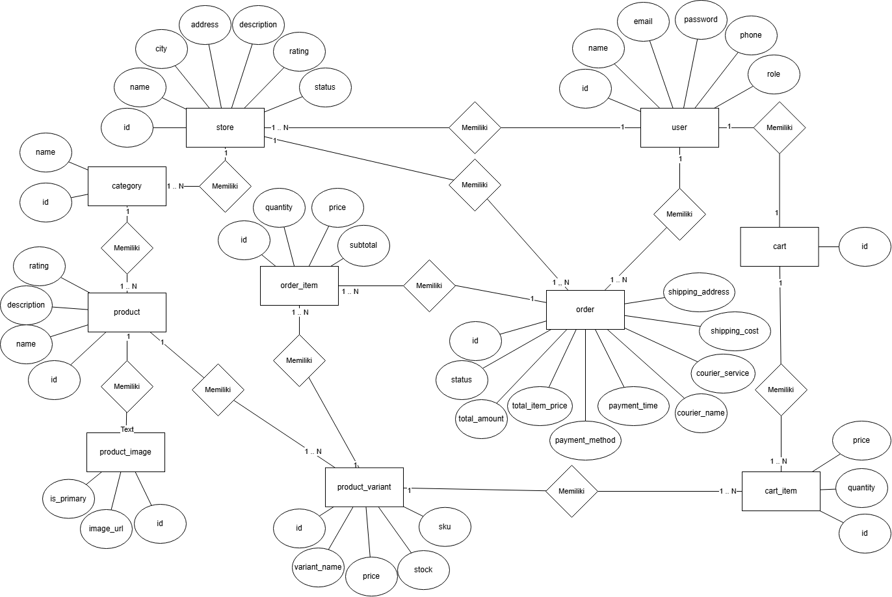
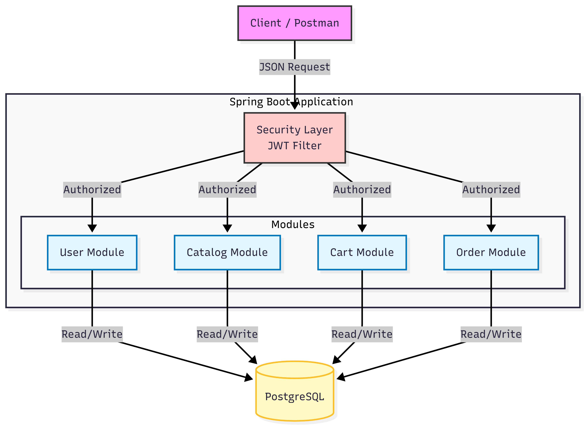

# Soal test maggang Backend engineer dengan Springboot

Berikut adalah soal/pertanyaan yang perlu dijawab oleh peserta maggang

## knowledge base

1. Apa yang anda ketahui tentang Rest API?
Jawaban : cara untuk berkomuniakasi antara frontend(client) dengan backend(server) menggunakan HTTP. misalnya client minta data pegawai, server meresponse dengan memberikan data pegawai dalam bentuk JSON. Contoh metode HTTP adalah GET, POST, PUT, DELETE.

2. Apa yang anda ketahui tentang Server side and Client side processing?
Jawaban :
    - Client-side processing : proses eksekusi kode yang dilakukan di sisi pengguna, yaitu pada web browser atau aplikasi pengguna. Kode (biasanya menggunakan HTML, JS, dan CSS) diunduh dari server dan dieksekusi langsung oleh browser

    - Server-side processing : proses eksekusi kode yang dilakukan di server web, yang merupakan tempat menyimpan, memproses, dan mengirimkan resource aplikasi. cara kerjanya kirim request dari klien ke server, kemudian server akan menjalankan logika bisnis, berinteraksi dengan database, memproses data, dan kemudian mengirimkan response kembali ke klien. 

3. Apa yang anda ketahui tentang Monolith dan Microservices, berikan contohnya?
Jawaban : 
    - Monolith adalah arstitektur aplikasi yang dibangun sebagai satu unit yang saling bergantung dan terintegrasi. semua fungsi (UI, logika bisnis, akses data, dll) dikemas dalam 1 deployable unit. 
    
    Kelebihannya : (1) sederhana untuk aplikasi dengan skala kecil. (2) komunikasi antar modul sangat cepat karena berada dalam proses yang sama. Kekurangannya : (1) sulit untuk scalling secara parsial, harus seluruh aplikasi. (2) sulit untuk di-maintance jika ukurannya menjadi lebih besar. (3) biasanya terikat pada 1 tech stack saja

    - Microservice adalah arsitektur aplikasi yang dibangun dengan membagi menjadi kumpulan service yang kecil, yang independen, dan bisa dijalankan secara terpisah. setiap service (layanan) berfokus pada satu fungsi bisnis saja dan dapat memiliki database dan tech stack nya sendiri.
    
    Kelebihannya : (1) lebih mudah untuk skalibitas, karena setiap service di-scale secara independen. (2) kalau ada service yang gagal atau error, service yang lain tetap bisa berjalan. (3) tech stack nya bisa disesuaikan dengan service yang dikembangkan. (4) jika ada update di 1 service, tidak perlu penerapan ulang di keseluruhan aplikasi. Kekurangannya : (1) lebih kompleks dalam hal deployment, monitoring, tracing, dan komunikasi antar servic. (2) lebih sulit untuk menangani transaksi yang melibatkan beberapa service.

4. Apa yang anda ketahui tentang Design pattern inversion of Control serta Dependency Injection?
Jawaban : 
    - Inversion of Control (IoC) merupakan sebuah prinsip desain dimana pengontrolan alur pembuatan objek dan pengelolaan dependensi tidak dilakuka oleh kode sendiri, tetapi "dibalik" dan diserahkan kepada framework, contohnya spring.

    - Dependency Injection merupakan cara kerja IoC yaitu teknik untuk "menyuntikkan" dependensi ke sebuah class tanpa membuatnya sendiri. ada 3 istilah, (1) client : objek yang membutuhkan dependesi. (2) service/dependency : objek yang dibutuhkan. (3) injector : Entity yang bertanggung jawab untuk memasukkan layanan ke klien.

    3 jenis Dependency Injection 
        - Constructor Injection : Dependesi yang disediakan melalui contructor class.
        - Setter Injection : Depedensi disediakan melalui metode setter publik, digunakan jika depedensi opsional.
        - Field/Property Injection : Depedensi yang "disuntikan" lansung ke field class, tidak direkomendasikan karena tidak terlihat pada constructor, dan susah di tes.

5. Apa yang anda ketahui tentang Java programming dan Spring framework khususnya spring-boot? 
Jawaban : Java programming adalah bahasa pemrograman yang berorientasi object (OOP) jadi mendukung konsep class & object, encapsulation, inheritance, polymorphism, interface & abstraction, dan exception handling. Java juga bisa cross-platform "write once, run anywhere", dan juga digunakan untuk pengembangan aplikasi yang besar, seperti banking dan enterprise.

Spring framework merupakan salah satu dari framework Java yang paling populer dan komprehensif untuk pengembangan aplikasi. sedangkan spring-boot merupakan bagian dari spring yang bertujuan mempermudah pembuatan aplikasi backend. Keunggulan spring-boot adalah auto-configuration, struktur project yang rapi, memiliki depedency injection bawaan, mudah membuat REST API, dan integrasi mudah dengan JPA/Hibernate, Security, Kafka, dan Database

## Design modules

Dalam suatu schenario ada requirement membuat aplikasi e-commerse seperti Tokopedia seperti berikut:

1. Catalog, pelanggan mencari product di toko
    
2. Item, bisa melihat detail informasi produk
    
3. Cart, pelanggan bisa menambahkan produk yang ingin di beli ke keranjang
    
4. Setelah di checkout, masuk ke list transaction
    
5. Kita juga bisa liat detail transactionya
    

Kemudian temen-temen buat design database, module (monolith/microservices) berdasarkan gambar atau schenario tersebut. Serta jelakan mengapa menggunakan design tersebut.

Jawaban : 
Desain ERD
    
    
Desain Module
    

    - Pendekatan Arsitektur: Saya memilih pola Modular Monolith.

    - Alasan Pemilihan:
        Untuk fase awal (MVP), saya memilih arsitektur Modular Monolith dengan struktur Package-by-Feature.

        Awalnya saya mempertimbangkan Microservices, tapi untuk skala tim kecil dan traffic saat ini, overhead infrastrukturnya (manage banyak port, network latency, distributed tracing) terlalu besar dan overkill.

        Dengan pendekatan Modular ini, saya tetap mendapatkan kerapihan kode yang terisolasi per fitur (Cart, Order, Catalog) seperti Microservices, tapi dengan kemudahan deployment dan debugging layaknya Monolith. Jika nanti aplikasi membesar, memecahnya jadi Microservices jauh lebih mudah karena batasannya sudah jelas.

## Praktek

Berdasarkan analisa tersebut, buat project monorepo (pada repository ini) dengan menggunakan framework springboot seperti berikut specifikasinya:

- Database: `PostgreSQL 15`
- JDK version: `Oracle JDK 17 or later`
- Springboot version: `3.0.x`

terkait design system Toko, Barang, Pembelian pada ecommerse tersebut.

Jawaban : 
    - Spreadsheet test case : https://docs.google.com/spreadsheets/d/18Q1wS0MB-D2cwHTYrbJ-u-rSGJiUzK52g2oBAu3YKI8/edit?usp=sharing 